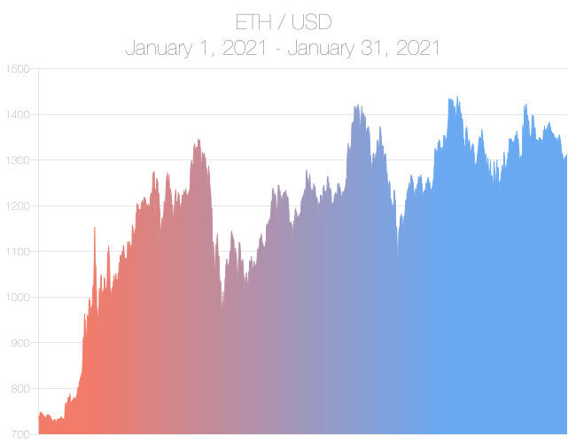

# CryptoCharts Server

    

# Purpose
This server mines Chainlink's ETH/USD data feed for historical data, generates and uploads chart images to IPFS, and pushes metadata to the NFT contract.

# How It Works
1. `syncDbWithDataFeed()` retrieves all historical data from Chainlink's ETH/USD data feed by calling `getRoundData()` in our PriceConsumerV3.sol contract. The data is saved to a MongoDB database.
2. `generateMetadata()` queries the database to obtain batches of monthly price data, then passes the data to `createChartImage()`.
3. `createChartImage()` generates a chart image for each batch of price data and saves it to the `output` folder.
4. `uploadImageFolder()` uploads all NFT metadata to IPFS and returns a metadata array.
5. `generateMetaData()` finally calls contract function `addChart()` to store IPFS URLs.

# Technologies Used
## Hackathon Prize Categories
- NFT (topic)
- Alchemy
- Chainlink Data Feed
- NFT.Storage

## Miscellaneous Tech
- Ethers
- Node.js
- Koa.js
- MongoDB

# Known issues
1. The Chainlink data feed for ETH/USD seems to be missing historical price data between May 6, 2021 and June 4, 2021 (round IDs 0x20000000000001D91 and 0x20000000000001D92).

# Next Iteration
1. Implement continuous monitoring of the Chainlink data feed for new round data.
2. Automatically generate the chart image on the first of each month.
